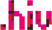

# dotHIV Graphics Library

This repository contains graphics used by various dotHIV projects.

## dotHIV Logo

 * [SVG](./svg/logo.svg)
 * License: No use without written permission. © dotHIV gemeinnütziger e.V., Lehmbruckstrasse 3, D-10245 Berlin, http://dotHIV.org/

## Red Ribbon

 * [SVG](./svg/ribbon.svg)
 * License: Public Domain
 * Author: Markus Tacker <m@dotHIV.org>, based on a work by [Amada44](http://de.wikinews.org/wiki/Datei:World_Aids_Day_Ribbon.svg)

## Banner Graphics

### Coin Close Animation

 * [Source Frames](./bitmap/coin-close-animation/)
 * License: No use without written permission. © dotHIV gemeinnütziger e.V., Lehmbruckstrasse 3, D-10245 Berlin, http://dotHIV.org/
 * Authors: Philipp Kafkoulas <pt@dotHIV.org> and Markus Tacker <m@dotHIV.org>
 * Copyright: dotHIV gemeinnütziger e.V., Lehmbruckstrasse 3, D-10245 Berlin, http://dotHIV.org/

## Browser Plugin Icons

### Disabled state

 * [SVG](./svg/browser-plugin/disabled.svg)
 * License: No use without written permission.
 * Author: Markus Tacker <m@dotHIV.org>
 * Copyright: dotHIV gemeinnütziger e.V., Lehmbruckstrasse 3, D-10245 Berlin, http://dotHIV.org/

### Off state

 * [SVG](./svg/browser-plugin/off.svg)
 * License: No use without written permission. 
 * Author: Markus Tacker <m@dotHIV.org>
 * Copyright: dotHIV gemeinnütziger e.V., Lehmbruckstrasse 3, D-10245 Berlin, http://dotHIV.org/

### Email

 * [SVG](./svg/browser-plugin/email.svg)
 * License: [Creative Commons Attribution-NonCommercial-ShareAlike 4.0 International License](http://creativecommons.org/licenses/by-nc-sa/4.0/).
 * Authors: Philipp Kafkoulas <pt@dotHIV.org> and Markus Tacker <m@dotHIV.org>
 * Copyright: dotHIV gemeinnütziger e.V., Lehmbruckstrasse 3, D-10245 Berlin, http://dotHIV.org/

### Facebook

 
 * [SVG](./svg/browser-plugin/facebook.svg)
 * License: [Creative Commons Attribution-NonCommercial-ShareAlike 4.0 International License](http://creativecommons.org/licenses/by-nc-sa/4.0/).
 * Author: Markus Tacker <m@dotHIV.org>
 * Copyright: Facebook, see https://www.facebookbrand.com/

### Google+

 
 * [SVG](./svg/browser-plugin/googleplus.svg)
 * License: [Creative Commons Attribution-NonCommercial-ShareAlike 4.0 International License](http://creativecommons.org/licenses/by-nc-sa/4.0/).
 * Author: Markus Tacker <m@dotHIV.org>
 * Copyright: Google, see https://developers.google.com/+/branding-guidelines

### LinkedIn

 
 * [SVG](./svg/browser-plugin/linkedin.svg)
 * License: [Creative Commons Attribution-NonCommercial-ShareAlike 4.0 International License](http://creativecommons.org/licenses/by-nc-sa/4.0/).
 * Author: Markus Tacker <m@dotHIV.org>
 * Copyright: LinkedIn, see http://press.linkedin.com/Media-Resources?SubjectID=644

### Twitter

 
 * [SVG](./svg/browser-plugin/twitter.svg)
 * License: [Creative Commons Attribution-NonCommercial-ShareAlike 4.0 International License](http://creativecommons.org/licenses/by-nc-sa/4.0/).
 * Author: Markus Tacker <m@dotHIV.org>
 * Copyright: Twitter, see https://about.twitter.com/press/brand-assets
